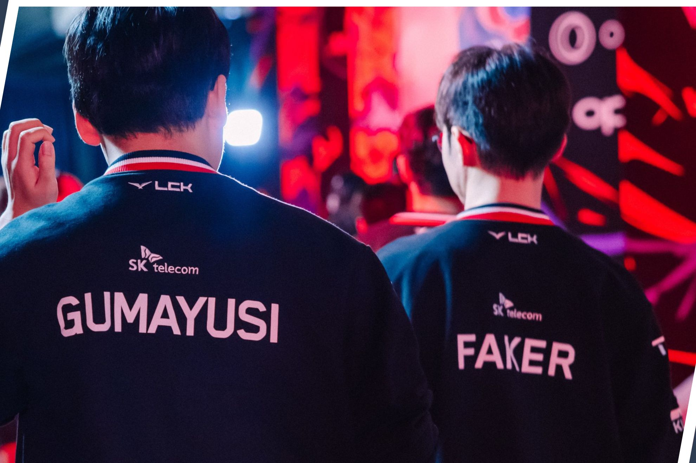

:::{#ppc}
Hi! My name is Luc Dinh (Luke), Welcome to my personal website!!! I am a senior Data Science/ Math Student at CU Denver. I always like to work and mess around with technology, especially if they are fun and exciting. which is also why I love Machine Learning, Deep Learning and AI so much I decided to study Data Science. I hope that after I graduate, I will have the opportunity to work and learn even more on how to build such amazing models and apply data science knowledge for the best insights

## SKILLS
- Machine Learning
- OCR Models
- Computer Vision
- CNN
- Data Wrangling and Visualization

## HOBBIES
- GAMING 

I am a big offline games, for online game my favorite professional players are Faker and Gumayusi


- EXPLORING
- MOVIES
- COOKING
:::
---

```{}
```
